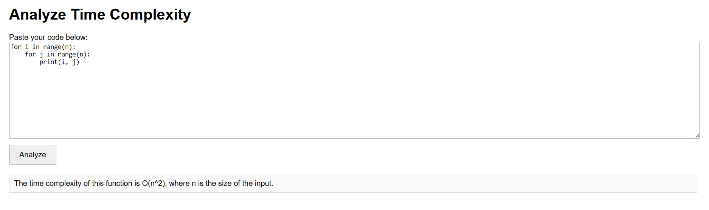

 # 🧠 Time Complexity Analyzer

A web-based tool that analyzes the **time complexity** of a given code snippet using an LLM-powered backend. The system uses **Spring Boot** with **Spring AI** and the **Ollama Gemma:4b** model to provide intelligent, language-model-based complexity analysis.

## 🔧 Features

- 🔁 **REST API**: POST endpoint to analyze time complexity from code.
- 🤖 **LLM Integration**: Powered by Ollama’s `gemma:4b` model using Spring AI.
- 🖥️ **Frontend Interface**: Simple HTML/CSS/JavaScript UI to input code and display results.
- 🚀 Fast and lightweight for local or network-based usage.

---


---

## ⚙️ Backend – Spring Boot + Spring AI

### 🔋 Requirements

- Java 17+
- Maven/gradle
- Ollama installed and `gemma3:4b` model pulled

### 🚀 How to Run

1. Clone the repository:
    ```bash
    git clone https://github.com/ashu-123/code-complexity-analyzer.git
    cd code-complexity-analyzer/backend
    ```

2. Start Ollama with the model:
    ```bash
    ollama run gemma:4b
    ```

3. Build and run the Spring Boot app:
    ```bash
    mvn spring-boot:run
    ```

### 📫 API Endpoint

- **URL**: `POST /analyze`
- **Request Body**:
    ```json
    {
      "code": "your source code here"
    }
    ```
- **Response**:
    ```json
    {
      "complexity": "The time complexity of this function is O(n^2), where n is the input size."
    }
    ```

---

## 🌐 Frontend – HTML/CSS/JavaScript

### ⚡ How to Use

1. Open the frontend folder:
    ```bash
    cd ../frontend
    ```

2. Open `index.html` in your browser.

3. Paste code into the textarea and click **"Analyze"**. The time complexity will appear below the button.

> Make sure the backend server is running on `http://localhost:8080` or update the URL in `script.js` accordingly.

---

## 🧪 Example Usage

### Input Code

```python
for i in range(n):
    for j in range(n):
        print(i, j)
```

### Output

The time complexity of this function is O(n^2), where n is the input size.




## 📌 Notes

- Supports all general-purpose programming languages like Python, Java, C++, C#, JavaScript.

- Make sure your machine has enough resources to run the gemma:4b model smoothly.

- Spring AI is used to wrap and integrate LLM inference easily via Spring Boot.

- Easy to switch to a different LLM model just by tweaking Spring AI properties.

## 🛡 License

This project is licensed under the MIT License.

## 👨‍💻 Author

Developed with the help of Ollama and the Spring AI ecosystem.

## 💡 Future Improvements

- Add support to calculate space complexity.

- Add support for wrong code detection.

- Provide detailed explanations of the analysis.

- Implement authentication or rate limiting for public APIs.

- Add Docker support for full stack deployment.